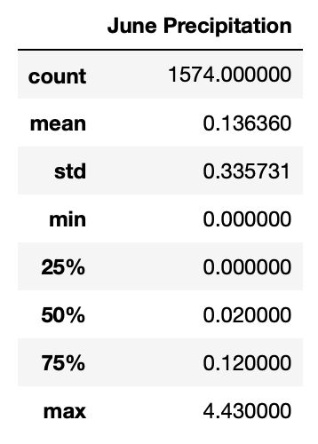
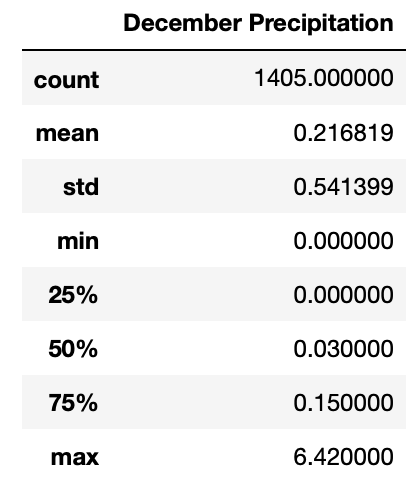

# Surf's Up Climate Statistical Analysis  
  
  * Analyst: Stan Misina. 
  * Source Data: SQLite database provided by client: **`hawaii.sqlite`**.  
      - containing data from 9 stations around Ohau, from Jan 1, 2010    
      - measurements available: temperature observed, and precipitation amounts
  * Source Code: Python v. 3.8.10 built in Jupyter Notebook 6.4.0. 
  
## Overview Statistical Analysis  
  
Clent requests information about temperature trends -- specifically, temperature data for the months of June and December in Oahu. This data will be key in determining viability of proposed surf and ice cream shop for year-round business.  The sample size is appropriate to make this analysis 
  
  
### Results  
  

  
The analysis yeilded these specific findings:  
  
* June is a warmer month with a low termperature of only 64&deg;F and a pleasant average temperature of 75&deg;F  
* December is cooler month with a low temperature of 56&deg;F, and the first quartile of results of 69&deg;F 
* Hawaii's average temperature when solely considered only varies +-4&deg;F from the beginning of summer to the dawn of winter  

### Summary  
  
Ice cream and Surfing in Hawaii are a 4 seasons business when looking at temperature. In managing operating and labor costs, the client may consider adjusting hours in the winter to be available during the warmest times of the day by opening later and closing earlier.  
  
The client made mention of how previous ventures were "rained out of business," which brings up another climate consideration: precipitation.  

The analyst has run a similar analysis for precipitation in June and December. This shows that the first 3 quartiles show that there is not much precipitation (0.12 and 0.15 respectively). However there have been heavy rains recorded in both June and December of 4.43 and 6.24, which means that there is a possibility for rainy Junes and Decembers. 
  
  
  

